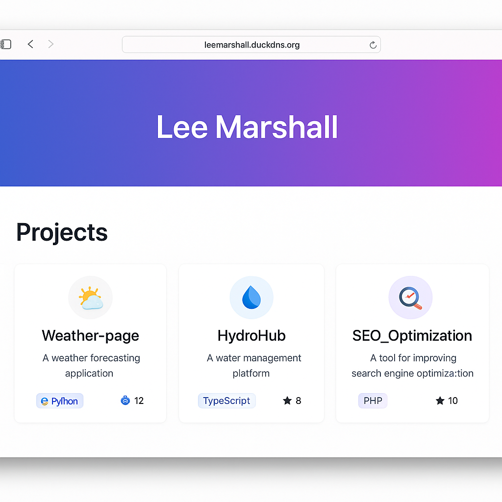

# Lee Marshall – Auto‑Updating Portfolio Site



A lightweight portfolio that **automatically lists every public repository** under **github.com/LeeMarshall1113**.

* **Front‑end:** React 18 + Redux Toolkit  
* **Back‑end:** PHP‑FPM 8.3 + MySQL 8  
* **Dev Ops:** Docker‑Compose (local) → Kubernetes / EKS ready  
* **CI/CD:** GitHub Actions optional auto‑deploy  

## Quick start

```bash
# Ubuntu 22.04
sudo apt update && sudo apt install docker.io docker-compose nodejs npm php-cli php-mysql mysql-server
git clone <this‑repo>.git
cd portfolio-site
sudo docker compose up --build -d
# open http://localhost
```

For a free public URL, use DuckDNS + Caddy or Cloudflare Tunnel (see full guide in the repo’s `README.md`).

---
